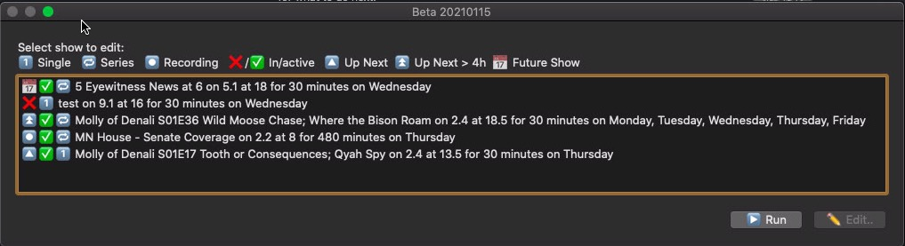

## hdhr_VCR
A pretty damn good VCR "plus" script that works on all HDHomeRun devices.
A faceless/background script that makes recording TV shows and Movies on HDHomeRun very easy.



#### Why?
I wanted to allow a quick way to record a TV show, without needing to setup a large system like Plex or HDHomeRuns' own DVR software.
I call it a VCR app, as while it does use guide data to pull name / season / episode number / episode name / show length, it does not present like a normal DVR.  It is more of a Smart VCR

#### Requirements
1. JSONHelper is required, available for free at https://apps.apple.com/us/app/json-helper-for-applescript/id453114608

#### Features
* Auto discovery of all HDHomeRun devices on your network!
* Uses built-in guide data, and lineup data, to automatically name the shows you are recording. 
* * The free guide data is only for the next 4-6 hours. We will attempt to pull fresh data right before a show starts, so in most cases, the information does get pulled correctly. I believe if you pay for HDHomeRuns own DVR software, the guide data is much longer, and the script would handle that.
* Runs in the background, but allows easy editing of existing saved shows.
* Uses caffeinate to ensure that the system does not go to sleep during a recording.
* Add a show or series in 10 seconds.

### How to use
1. Download the file hdhr_VCR.applescript, and open this in Script Editor.
2. Choose "Save as..." in the File Menu.
3. Save as "Application" and check "Stay open after run handler"  **MUST** be checked for this to work.
4. Save the file with the name hdhr_VCR.  I save this in the Application Folder.
5. Now we have a compliled application, we want to open it.

When you first run this, OSX will prompt multiple times for various system permissions.  Please grant all of these.

6. You will then be presented with options to see the existing shows, add a show, or "Run"  More about "Run" later.
7. If you have multiple tuners, you will be asked which one you would like to use fo this recording.
8. You will be presented with a channel list.  Select the channel this show is on.
9. You will then be asked to specify a time, it is done a bit strangely. We use 24 hour decimal time
* For example, if you wanted to record a show at 6:45 PM, you would enter 18.75. (.5 of an hour, is 30 minutes.  .75 of an hour is 45 minutes.)
* If you attempt to use a time that has already passed for today, it will assuem you mean tomorrow.
11. How that we have the channel, and the time, we can attempt to pull some guide data.  The free DVR guide provided by SiliconDust only gives us ~ 4 hours.  If we are able to pull this show information down, we will pre populate the next couple of questions with those as the defaults.
12.  You will now have the ability to set the recordings name.  The name provided is just temporary, as we will try to pull the guide data before the recording starts. Again, we cannot pull guide data for any show that starts more then 4 hours from now.
13. In this same window, you will also tell the script if this is a a "Single" or a "Series"
* A "Single" is a one off recording, perhaps to record a show as a one off.
* A "Series" is meant for shows that air at the same time, perhaps 1 day or week, or 7, at a certain time.
14. The next screen allows you to tell us which day you wish to record.  It will default to today.
* If you selected a "Series" you can select as many days as you wish.
* If you select "Single" you can only select one day.

This allows you to set up a recording up to a week in advance.

15. You will then select where you want the file to be saved.  The default location is "/Volumes/", but you will need to select a specific location.  Any attempts to select "/Volumes/" as the destination will re prompt you for a valid location.
16. If you own a "Extend" device, or a device that has transcode capibilities, you can select which profile you wish to you.

Wow, that was alot.  In practice, you can add shows very quickly, and I over described this process, as this is the primary way to interact with the script.


"You told me you would tell me what "Run" is for?
The button that shows "Run" in almost all dialogs, will drop you back into the idle() handler.  This allows the script to run as needed.  It is important to know that the idle() is NOT running when a dialog is open.  If a dialog stays open forever, we will never be able to record, or update anything in the script.  Because of this, most dialogs have a timeout of 60 seconds, before auto closing.

"I did that, but nothing happens!"
That is accurate.  When the script is configured with a show, it is faceless, and you do not need to do anything, other then allow it to run.

"I want to add or edit a show"
If you click the icon in the Dock, you will be presented with the main window, so you can do such things."

"How do I know something is happening?
We use notifications to alert the user to recordings being started, in progress, and completing.  This may cause lots of notifications to occur, if a lot of shows are scheduled.  If there is a better way to be able to tell the user something, let me know.

"I need to quit the script, but I have a recording in progess"
If you want to quit the script, the best way to do so is being in a "run" state (faceless) and then issuing a command q, or selecting "Quit" from the hdhr_VCR FIle menu.
* If a show is currently recording, you will be prompted to tell you.  You can choose to go back to the main screem, quit, and cancel all recordings, or quit, but do not cancel the shows.  Since the recording is done with "curl", hdhr_VCR does not need to be open once a recording has already started.
**In almost every case, you should choose to not to cancel the shows. **

## Nitty gritty  
Uses records to store complex data sets. 

This is an example of a what data of a show recording contains:

```
(show_title:In Living Color, show_time:1, show_length:60, show_air_date:Saturday, show_transcode:None, show_temp_dir:alias Backups:, show_dir:alias Backups:, show_channel:5.1, show_active:true, show_id:17420a68e161e3def68e6111876f5dc6, show_recording:false, show_last:date Saturday, December 19, 2020 at 1:03:04 AM, show_next:date Saturday, December 19, 2020 at 1:00:00 AM, show_end:date Saturday, December 19, 2020 at 2:00:00 AM, notify_upnext_time:missing value, notify_recording_time:missing value, hdhr_record:1054271E,show_is_series:missing value)
```

Example of a tuner record:

```
(hdhr_lineup_update:Saturday, December 19, 2020 at 1:21:46 AM, hdhr_guide_update:Saturday, December 19, 2020 at 1:21:48 AM, discover_url:http://10.0.1.101/discover.json, lineup_url:http://10.0.1.101/lineup.json, device_id:1054271E, does_transcode:1, hdhr_lineup:missing value, hdhr_guide:missing value, hdhr_model:"HDTC-2US", channel_mapping:missing value, BaseURL:missing value)
```

The hdhr_guide and hdhr_lineup contain the entire json result of the lineup, and guide data.  We use this as a cache, so we only make a "new" API call every 2 hours, or when a show starts recording.

## Special considerations
* The "heavy lifting" is done with curl, which downloads the data to a local drive.  The script manages the show and device logic.
* If there are multiple HDHR device on the network, you will be asked which one you want to use when adding a show.
* When adding a show, we will attempt to write a test file to that location (and remove it) right away, so we can get through any of the OS X disk access prompts.  This file is written/removed every 5 minutes during a recording.  This will update the file, as seen in Finder.
* Heavily use notifications to pass along information to the user, as we run more or less faceless.  Future versions will allow you to specify you get a message such as:
* *  Starting recording
* * Recording in progress
* * End recording.
* * Tuner and Lineup updates (On launch, and every two hours.)
  
I want to make these notifications better, but AppleScript has very limited ways to interact with the user.  Notifications make sense to me, as the app is faceless/background app

When adding channels, you are presented with a list of available channels, with station name, example:
```
  2.1 TPT2
  2.3 TPTLife
  ...
  ...
```

I hope this can be collaborative project, so other options that you use can be added.
