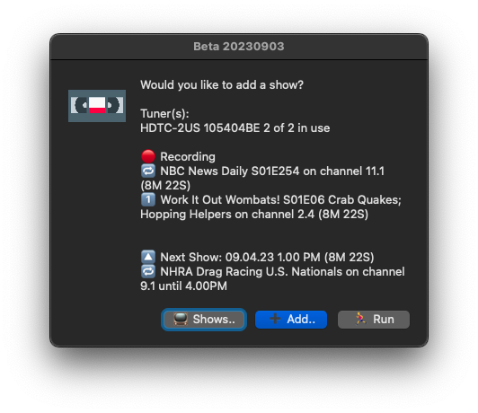
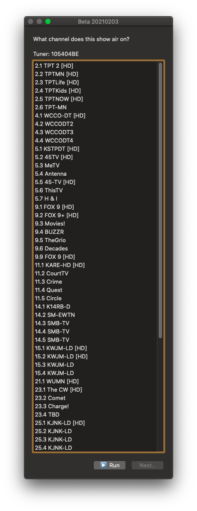
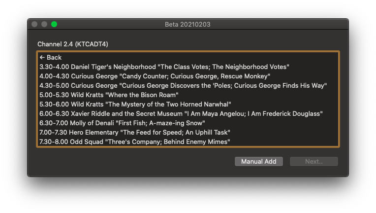
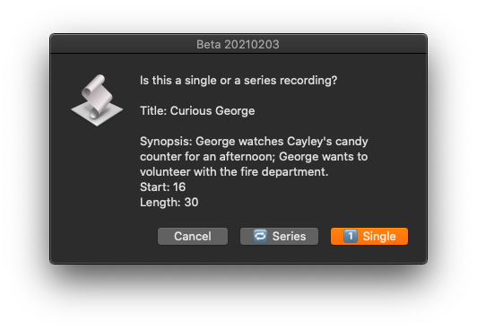

# hdhr_VCR

> **A Smart VCR script for all HDHomeRun devices.  
> No cloud. No subscriptions. No drama.  
> Just simple, AppleScript-powered TV recording for macOS.**


---

## Why?

I wanted to record TV shows quickly on my HDHomeRun, without a massive install or a paid DVR system. This project gives you guide-based, one-click recording—no accounts or setup fees.

---

## Features

- **Automatic HDHomeRun discovery** – Finds all compatible tuners on your network.
- **Guide-based recording** – Automatically pulls show, season, episode, and timing info.
- **Icon-rich selection views** – Show list, channel list, and grid surface lineup badges (`[HD]`, favorites). In the show edit list, the left icon represents next-airing status, the right icon represents show type, and inactive shows use the cancel icon.
- **Deterministic multi-select mapping** – Duplicate-looking rows are resolved by selection order so edits/adds never collapse into a single matched item.
- **Flexible Series Recording:**  
  • Record by channel or *across all channels* for syndicated shows  
  • SeriesID tracking — the guide tells us when and where the next episode airs  
  • Auto-updates channel, time, length, and episode title from the guide with no manual input  
- **Smart episode queuing:**  
  • Series IDs are queued and processed at the end of the idle loop — no mid-loop thrashing  
  • On recording complete, SeriesID shows are immediately re-queued to find the next episode  
  • When no upcoming episodes are found, the show retries automatically every 4 hours  
- **Orphan process cleanup:**  
  • Detects and kills stale `curl` recordings that ran past their end time  
  • Scans for pre-existing recordings on startup so a relaunch doesn't double-record  
- **Robust disk space management:**  
  • Checks both percentage *and* absolute free space before starting a recording  
  • Blocks recording if disk is over 93% full or under 10 GB free  
- **Locale-independent date handling:**  
  • Dates stored as Unix epoch integers — works correctly on both `en_US` and `en_GB` Macs  
  • No more "date string won't parse" failures when the system locale changes  
- **Modular script design:**  
  • Core logic lives in `hdhr_VCR_lib.scpt` — main app stays lean, library updates don't require recompiling the full app  
- **Structured logging:**  
  • TRACE / DEBUG / INFO / WARN / ERROR / FATAL levels throughout  
  • Handler-call-chain context on every log line (e.g. `seriesScanUpdate_lib(idle(1908))`)  
  • Optional JSON log mode: opens raw API calls in a browser for live troubleshooting  
- **Smart error handling:**  
  • Auto-pauses a show after 3 consecutive recording failures  
  • Protects against accidental config wipeouts — backs up before writing  
  • Guards against missing `show_url`, empty `show_dir`, and no-tuner edge cases  
- **Easy Add / Edit / Manual Add workflows**
- **macOS notifications:** "Up next" warning, recording started, recording complete
- **Runs quietly in the background — no complex setup needed**

---

## What's New

These improvements were made during a focused reliability and feature pass in early 2026. All changes are live on `main`.

### Bug Fixes

| Fix | Impact |
|-----|--------|
| **Infinite idle loop** — when `show_next` was stuck at epoch 0 (1970), the "advance by 4 hours" retry kept it in 1970, firing the idle loop every 1 second forever. Fixed to advance from `current date` instead. | Stops CPU/log thrashing on shows with no upcoming guide data |
| **Locale date serialization** — dates were stored as locale-formatted strings (e.g. `"Thursday, April 23, 2026 at 9:30:00 PM"`), which silently broke deserialization on `en_GB` Macs. Fixed to use Unix epoch integers throughout. | Non-US users can now run hdhr_VCR without show dates corrupting |
| **Disk check logic** — the free-space condition used `or` instead of `and`, meaning a 99%-full disk would still start a recording if it happened to have enough absolute free bytes. | Recording no longer starts when disk is critically full |
| **Guide hours config** — the Setup dialog was reading from the wrong variable (`Guide_hours` global vs. `GuideHours` config key), so the setting appeared to save but reverted on relaunch. | Guide hours now persist correctly across restarts |
| **Corrupt config on save** — `save_data` was calling `fixDate()` on `notify_recording_time` and `notify_upnext_time` before serializing, converting epoch integers back to date objects, which caused JSONHelper to silently blank the config file. | Config file no longer gets wiped on save |
| **False "recording in progress" warnings** — shows were flagged as actively recording when they weren't, blocking the next scheduled start. | Recordings start on time without manual intervention |
| **Missing fields on load** — `deserialize_show` did not add fields introduced after a show was first saved, causing key errors on older config entries. | Existing configs survive upgrades without manual editing |
| **SeriesID shows could never start** if `show_url` was empty — `record_start` now guards this early and logs an ERROR instead of attempting a malformed `curl` command. | Clear error message instead of a silent failed recording |
| **Guide data timezone interpretation** — the HDHomeRun API returns episode times as "local time encoded as UTC epoch". Without correction, show_next would be deserialized 5+ hours too early (one full timezone offset), causing recordings to start before the scheduled time. Fixed to subtract GMT offset when extracting guide times. | SeriesID shows now trigger recording at the correct scheduled time, not hours early |

### New Behaviour

- **Queue on recording complete** — when a SeriesID episode finishes, the show is immediately re-queued for a series scan so the next episode is found without waiting for the next guide refresh.
- **Channel auto-detect** — `seriesScanUpdate` always writes back the channel found in the guide, keeping the show record in sync even when a syndicated show moves channels.
- **Startup series scan** — on launch, `seriesScanRun` fires once after device discovery (guarded by `Hdhr_detected`) so shows are ready before the first idle cycle completes.
- **Guide refresh at ¼ of guide duration** — if you fetch 6 hours of guide, it refreshes every 90 minutes instead of waiting the full window.
- **On-demand save strategy** — config is saved only when something changes (add, edit, recording complete, deactivate), not on every idle tick.
- **Orphan curl cleanup** — stale recording processes are killed at the end of every idle cycle, and pre-existing recordings are detected on startup.

---

## Key Advantages

**No subscriptions, no cloud, no accounts.**  
hdhr_VCR talks directly to your HDHomeRun device's local API. Every show, every schedule, every guide lookup happens on your own network. The only outbound call is to the HDHomeRun guide service your device already uses.

**SeriesID tracks the show, not the timeslot.**  
Traditional timer-based DVRs break when a show moves nights or preempts for a special. hdhr_VCR uses the same SeriesID that cable providers use — if the guide knows about the episode, hdhr_VCR will find it, on any channel, at any time.

**Self-healing schedule.**  
When a show goes on hiatus and has no upcoming episodes in the guide, hdhr_VCR quietly waits and retries every 4 hours. When the show returns, it picks up automatically — no user action required.

**Locale-safe.**  
Dates are stored as Unix epoch integers. The app runs correctly on both `en_US` and `en_GB` systems without locale-specific date string parsing.

**Transparent operation.**  
Every decision — guide lookup, episode match, disk check, recording start — is logged with full handler context. When something goes wrong, the log tells you exactly where and why.

---

## Requirements

1. macOS
2. [JSONHelper](https://apps.apple.com/us/app/json-helper-for-applescript/id453114608) is required (free)
3. A configured HDHomeRun device from [SiliconDust](https://www.silicondust.com)
4. The HDHomeRun device should have a static IP — we record the device IP when a show is added
5. hdhr_VCR needs access to the following paths:

   - `~/Documents/hdhr_VCR-{hostname}.json`
   - `~/Library/Logs/hdhr_VCR.log`

---

## Quick Start

1. Clone or download the repo.
2. Run `./deploy.sh` — this compiles `hdhr_VCR.applescript` to `hdhr_VCR.app` and the lib to `~/Documents/hdhr_VCR_lib.scpt`.
3. Launch `hdhr_VCR.app` from the deploy location.
4. On first run, grant the necessary permissions (macOS will prompt).

> **Script Editor alternative:** Open `hdhr_VCR.applescript` in Script Editor → File → Export → Application, with "Stay open after run handler" checked.

---

## How to Use

The app supports **4 different recording modes**:

1. **Single** — Record one episode on a specific day/time/channel
2. **DateTime Series** — Record specific days/times on a specific channel
3. **SeriesID(Channel)** — Record all episodes on one channel, guide-driven scheduling
4. **SeriesID(All)** — Record all episodes on any channel, fully guide-driven

**Quick workflow:**
- **Add**: Pick a tuner → enter title → choose mode → answer the relevant prompts
- **Edit**: Click app icon → Edit → select show → modify settings
- **Run**: Returns to idle recording mode

Each mode only prompts for the fields it needs. SeriesID modes skip time, day, and length — the guide supplies those automatically.

---

## Documentation Guide

### 👤 For Users
- **[WORKFLOWS.md](docs/WORKFLOWS.md)** — Step-by-step guides for adding/editing shows in each mode
- **[UI_EXPECTATIONS.md](docs/UI_EXPECTATIONS.md)** — Dialog layouts, status icons, cancellation behavior, error recovery, and complete interaction flows
- **[SHOW_STATUS.md](docs/SHOW_STATUS.md)** — 4-state convention and validation rules

### 👨‍💻 For Developers  
- **[CLAUDE.md](CLAUDE.md)** — Project overview, architecture, critical requirements, and key handlers
- **[handler.md](docs/handler.md)** — Complete handler reference for both applescript files
- **[APPLE_SCRIPT_STYLE.md](docs/APPLE_SCRIPT_STYLE.md)** — Code style conventions and best practices
- **[ADVANCED_PROCESSES.md](docs/ADVANCED_PROCESSES.md)** — Technical deep dives (SeriesID, recording lifecycle, etc)

### 🔧 For Contributors
- **[AGENTS.md](docs/AGENTS.md)** — Contribution guidelines and PR standards
- **[TESTING.md](docs/TESTING.md)** — Smoke testing checklist and automated tests

### 📜 Reference
- **[CHANGELOG.md](docs/CHANGELOG.md)** — Release history and version tracking

---

## Screenshots

_Visual walkthrough — screenshots can be replaced with updated versions:_



- **Channel List Selection**



- **Show Grid / Guide View**



- **Show Info**



---

## How It Works

- Scans for tuners on startup, fetches lineup and guide data via the HDHomeRun local API.
- Stores all show config in a JSON file at `~/Documents/hdhr_VCR-{hostname}.json`.
- Uses `curl` for all network and recording transfers.
- Wraps recordings in `caffeinate -i` to prevent the Mac sleeping mid-record.
- Idle loop runs every ~10 seconds; accelerates to 1 second when a recording is imminent.

```applescript
{show_title:"Example Show S03E04", show_time:20, show_channel:"5.1", show_is_series:true, show_use_seriesid:true, ...}
```

---

## Developer Testing

Run the on-demand locale/time handler tests before larger date or locale changes:

- `./scripts/run_time_tests.sh`
- `./scripts/run_time_tests.sh --locale en_US`
- `./scripts/run_time_tests.sh --locale en_GB`
- `./scripts/run_time_tests.sh --fixture-date "Tuesday, January 2, 2024 at 1:05:09 PM" --fixture-date-half "Tuesday, January 2, 2024 at 1:30:09 PM"`

See [docs/TESTING.md](docs/TESTING.md) for full testing guidance.

---

## Maintainer Automation

See [docs/CODEX_REQUESTS.md](docs/CODEX_REQUESTS.md) for details on the workflow that archives Codex requests automatically after a pull request merges.
