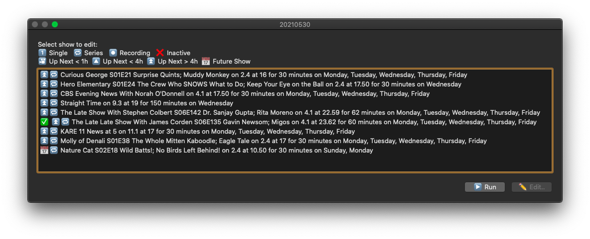

# hdhr_VCR UI/UX Expectations

**Design specification for user-facing interactions and workflows. Describes WHAT the system should show and WHY — not HOW or exact button labels.**

> **Related Docs:** [UI_SCREENS.md](UI_SCREENS.md) — Exact dialog specs with code references · [WORKFLOWS.md](WORKFLOWS.md) — User task flows · [SHOW_STATUS.md](SHOW_STATUS.md) — Show state model · [ADVANCED_PROCESSES.md](ADVANCED_PROCESSES.md) — Technical implementation

---

## Date/Time Architecture

**Storage:** All times stored as **UTC epoch integers** in the config file for timezone portability.

**Display:** All times shown to users in **local time** via UI dialogs and logs.

**Conversion:** 
- Storage → Display: `epoch2datetime()` converts UTC epoch to local date, then `short_date()` formats for display
- Display → Storage: User selects local time → converted to UTC epoch → stored

---

## Main Screen - Show List

The main screen displays an active show list sorted by next air date, with controls for add/edit/remove/settings operations.

### Status Icon System

| Icon | Meaning | Condition |
|------|---------|-----------|
| ✓ | Recording Active | Show in progress |
| ⚠ | Warning | Failures pending retry or paused after 3 failures |
| ✗ | Paused | Stopped, awaiting user intervention |
| ● | Signal strength | Tuner signal quality during recording |
| 🔄 | Refreshing | SeriesID show queued for guide scan |
| ⏱ | Time warning | Recording starts within 15 minutes |
| 📡 | Device offline | HDHomeRun device not detected |

### Show Entry Display

Each show displays:
- **Title** with optional episode number (S##E##) for guide-matched shows
- **Next air date/time** (local time)
- **Recently recorded** indicator if show recorded today
- **Status icon** showing current state

Shows remain on screen until explicitly removed. Active shows appear first (sorted by next air), inactive shows at bottom.

---

## Workflows: Adding a Show

Two distinct paths exist:

### Path 1: Guide-Based (from channel browsing)
User selects a channel → sees available shows in guide → selects an episode → validates fields. Fast for shows in the guide, provides auto-populated metadata.

### Path 2: Manual Add (direct dialogs)
User enters all details via sequential dialogs (title, type, days, channel, time, duration, folder). Used for shows not yet in guide or for custom schedules.

**See [UI_SCREENS.md](UI_SCREENS.md) for exact dialog sequence, button labels, and validation rules.**

### Cancellation Behavior

Every dialog in the add workflow has a cancel option. Pressing it at any point returns to the main screen and **discards ALL previously entered data**. The show is not added to the config.

---

## Recording Lifecycle — User Perspective

### Pre-Recording
- User adds show with future air date
- Show appears on list with status icon indicating next air
- 35 minutes before air: "Up Next" notification appears (if enabled)

### Recording Active  
- 15.5 minutes before air: "Recording about to start" notification
- Recording starts: Status changes to recording icon (✓)
- Show appears with active indication on main list
- During recording: Signal strength displayed

### Recording Complete
- Recording ends: Status reverts to normal
- Completion notification appears (if enabled)
- For DateTime series: Next episode calculated and queued
- For Single: Show marked inactive (paused)
- For SeriesID: Next episode in series scanned and queued

### Failure States
- Recording fails to start or stop unexpectedly
- User sees warning icon (⚠) on show
- After 3 failures: Show auto-paused, requires user intervention
- User can edit show to reset failure count and resume

---

## Notification Messages

System delivers notifications at key lifecycle points:

| Event | Condition | Message |
|-------|-----------|---------|
| **Recording Up Next** | 35 min before air | "[Show Title] is up next at [time]" |
| **Recording About to Start** | 15.5 min before air | "Recording [Show Title] in 15 minutes" |
| **Recording Started** | At air time | "Recording [Show Title]" |
| **Recording Complete** | After end time | "[Show Title] recorded successfully" |
| **Recording Failed** | After failure | "[Show Title] failed to record — check logs" |
| **Show Paused** | After 3 failures | "[Show Title] paused after 3 failures" |

---

## Error Handling Philosophy

**Design principle:** Errors are informative, recoverable, and never silent.

### Recording Failures
- First failure: Warning icon appears, user notified
- Subsequent failures: Retry automatically at next scheduled air
- After 3 failures: Show paused, user must manually reset to resume
- All failures logged with reason codes

### Guide/API Failures
- Guide unavailable: Show still appears, uses last-known air time
- Temporary API errors: Retry automatically every 5 minutes
- Persistent failures: Logged, user notified, manual refresh available

### Configuration/Storage Failures
- Config file corrupted: Backup restored automatically
- Config unreadable: App shows error and exits (safe)
- Failed write: User notified, retry on next save

---

## Edit Show Dialog

When editing an existing show:
- All current fields pre-populated with saved values
- Changing show type (Single → DateTime, etc.) dynamically reveals/hides relevant fields
- [Cancel] discards all changes, reverts to saved state
- [Save] writes changes to disk and updates main list immediately

---

## Notification Strategy

Notifications respect user preferences:
- Can be disabled/suppressed globally in settings
- "Up Next" notifications appear 35 minutes before air
- "About to start" notifications appear 15.5 minutes before air
- Notifications clear after 10 seconds or user dismissal

---

## Multi-Selection Behavior

### Guide Browser Multi-Select
When browsing the guide for shows to add:
- User can select **multiple episodes** from the same channel
- Selected shows queued for adding one at a time
- If a selected item is **already in the config** (matched by episode), edit dialog opens instead of adding
- After processing all selections, list regenerates automatically

**Important:** Show list is **dynamic during multi-select** — if a show's status changes (e.g., one completes recording or moves from active to inactive), those changes are reflected when the list regenerates after the multi-select operation completes.

### Main List Multi-Select
When selecting multiple shows from the main list:
- Checkbox allows **bulk selection** of multiple shows
- Edit button applies to selections
- Script processes shows **one at a time**, opening edit dialog for each selected show
- After completing all edits, list regenerates with current status
- Checkboxes do NOT persist across list regeneration — new list starts fresh

**Key Behavior:** If during multi-select editing, a show's status changes (e.g., recording completes while you're editing another show), the next show's display position may change. The show remains selected in your editing queue but may move positions in the list.

### Show List Updates During Multi-Select
The show list is regenerated after each operation:
1. User selects show(s)
2. Script processes selection (edit/add workflow)
3. List regenerates from current Show_info config (reflecting any status changes that occurred)
4. New list shows updated statuses, reordered positions (active → by next air date, inactive → bottom)
5. Checkboxes reset (not carried forward)

---

## Main List Interactions

### Selecting a Single Show
- Clicking a single show name opens edit dialog
- Edit dialog shows all fields for that show's type
- Fields are conditionally disabled based on show type (e.g., SeriesID shows hide time/duration)

### Bulk Operations (Multi-Select)
- Checkboxes enable multi-select for edit operations
- Selecting multiple shows opens edit dialog for **each show sequentially**
- After all edits complete, list regenerates showing updated status
- Cancel during any edit discards changes for that show, continues with next

### Removing a Show
- Delete operation available via checkbox selection
- Confirmation dialog lists affected shows
- Canceling prevents deletion, returns to main list with checkboxes preserved
- Confirming removes all selected shows and clears checkboxes

### Deactivating a Show
- Paused shows appear grayed out at bottom of list
- Can be reactivated by editing and toggling active checkbox
- Inactive shows don't generate notifications or attempt recordings
- Deactivating during multi-select: Show remains in config but won't record until reactivated

---

## Design Constraints

- **Time Input:** Decimal format (0-24 range, 9.5 = 9:30 AM)
- **Disk Space:** Recordings blocked when disk > 93% full (warning shown)
- **Tuner Conflicts:** Single tuner per show; no multi-tuner scheduling
- **Locales:** English only (en_US, en_GB) due to date formatting complexity

---

## Related Documentation

- **[UI_SCREENS.md](UI_SCREENS.md)** — Every dialog with exact mockups and code references
- **[SHOW_STATUS.md](SHOW_STATUS.md)** — 4-state model and valid state combinations  
- **[ADVANCED_PROCESSES.md](ADVANCED_PROCESSES.md)** — Recording lifecycle, SeriesID matching, error handling
